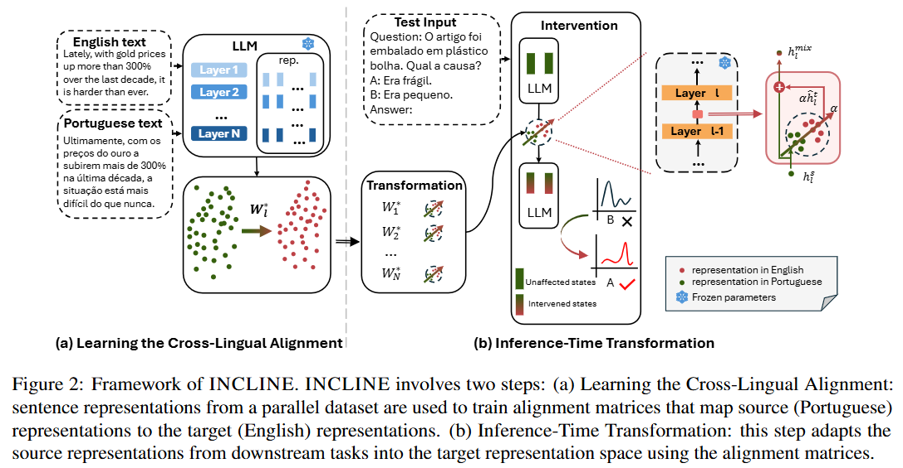
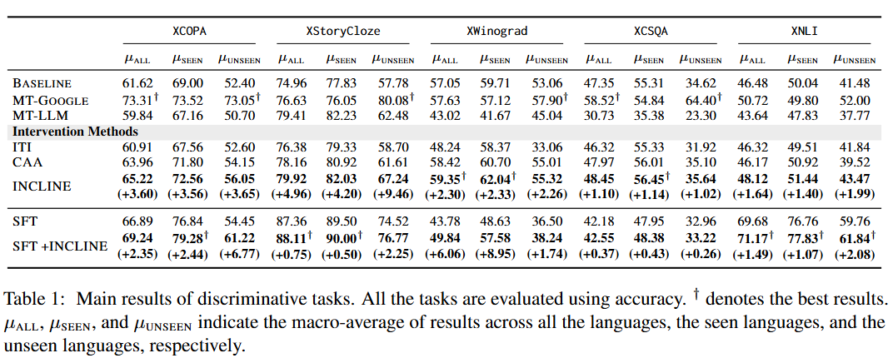
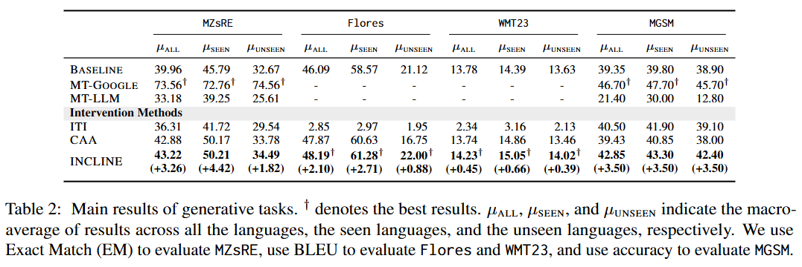
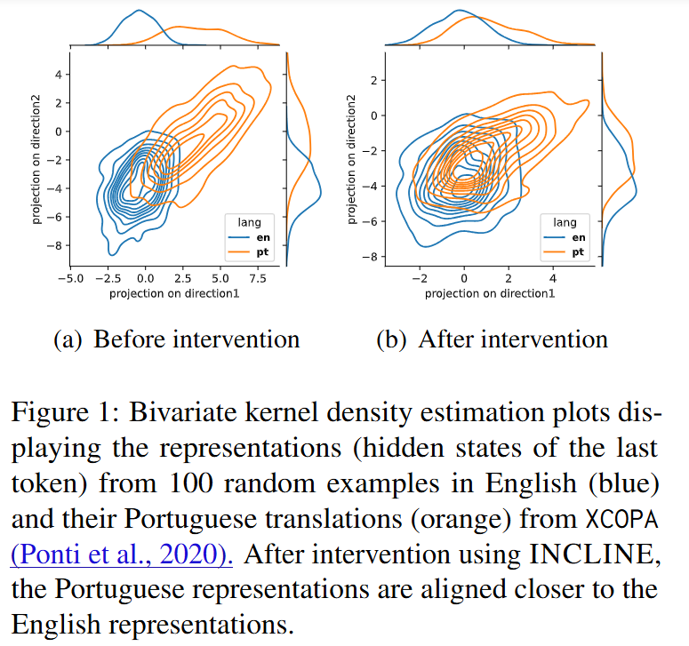
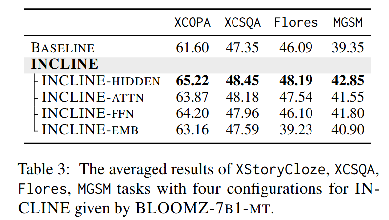
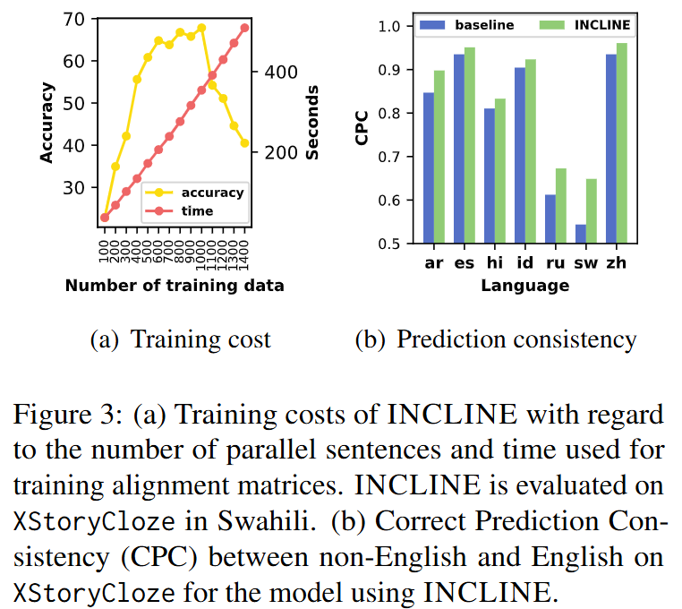
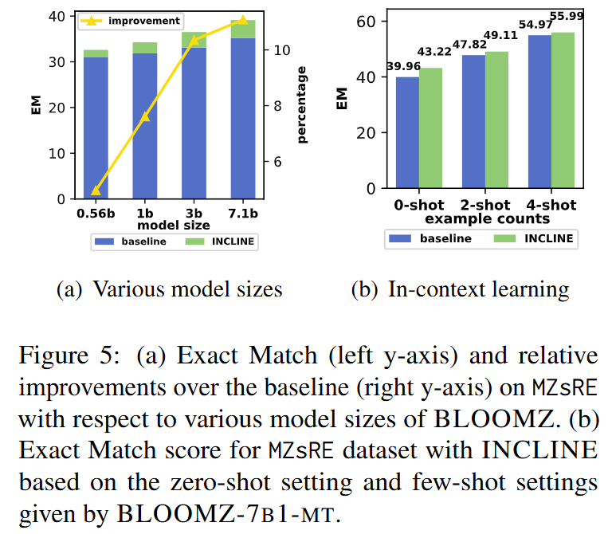

<h1 align=center>Bridging the Language Gaps in Large Language Models with Inference-Time Cross-Lingual Intervention</h1>

<h3 align=center>Weixuan Wang, Minghao Wu, Barry Haddow, Alexandra Birch


<h2 align=center>Abstract</h2>

Large Language Models (LLMs) have shown remarkable capabilities in natural language processing but exhibit significant performance gaps among different languages. Most existing approaches to address these disparities rely on pretraining or fine-tuning, which are resource-intensive. To overcome these limitations without incurring significant costs, we propose **Inference-Time Cross-Lingual Intervention (INCLINE)**, a novel framework that enhances LLM performance on low-performing (source) languages by aligning their internal representations with those of high-performing (target) languages during inference. INCLINE initially learns alignment matrices using parallel sentences from source and target languages through a Least-Squares optimization, and then applies these matrices during inference to transform the low-performing language representations toward the high-performing language space. Extensive experiments on nine benchmarks with five LLMs demonstrate that INCLINE significantly improves performance across diverse tasks and languages, compared to recent strong baselines. Our analysis demonstrates that INCLINE is highly cost-effective and applicable to a wide range of applications. In addition, we release the code to foster research along this line: https://github.com/weixuan-wang123/INCLINE


<h2 align=center>Contribution</h2>

- We propose INCLINE, a cross-lingual intervention approach that enhances LLMs by transforming source language representations into a target language representation space during inference **without requiring additional training** of LLMs.

- We conduct extensive evaluations across **five discriminative tasks** and **four generative tasks**, covering **21 languages**. Our experimental results show that INCLINE significantly improves model performance, boosting average accuracy by up to +4.96 compared to strong baselines .

- Our detailed analysis indicates that INCLINE is **highly cost-effective,** as it requires minimal computational resources while delivering substantial performance improvements. Moreover, we demonstrate that INCLINE is **effective with regard to LLM backbones, model sizes, and in-context learning**, underscoring its general applicability and potential for broader use in enhancing LLMs for underrepresented languages.


<h2 align=center>Methodology</h2>

<table align="center">
<tr>
  <td width="80%" align="center" valign="middle"></td>
</tr>
</table>


**Inference-Time Cross-Lingual Intervention (INCLINE)** comprises two main steps:

- **Learning the Cross-Lingual Alignment**: Using parallel corpora, we train alignment matrices for each layer to map source language representations to target language representations.

- **Inference-Time Transformation**: During inference, we utilize the learned alignment matrices to transform input representations from the source language into the target language representation space, thereby improving the LLM's performance on tasks in the source language.

By minimizing the distance between the source language representations and their corresponding target language representations, we effectively reduce cross-lingual representation gaps and align representation spaces across languages.


<h2 align=center>Experiments</h2>


<h3 align=center>Discriminative tasks</h3>

**INCLINE significantly improves discriminative task performance.**

<table align="center">
<tr>
  <td width="80%" align="center" valign="middle"></td>
</tr>
</table>

**INCLINE significantly enhances generative task performance.**

<h3 align=center>Generative tasks</h3>

<table align="center">
<tr>
  <td width="80%" align="center" valign="middle"></td>
</tr>
</table>

<h2 align=center>Analysis</h2>

**INCLINE effectively aligns the input representations in Portuguese to their parallel representations in English**.

<table align="center">
<tr>
  <td width="80%" align="center" valign="middle"></td>
</tr>
</table>


**Intervening on hidden states yields the greatest performance improvements.** This finding suggests that hidden states can capture comprehensive semantic information that is crucial for cross-lingual alignment. While INCLINE-Attention, INCLINE-FFN, and INCLINE-embedding also enhance performance, their performance gains vary across different tasks. 

<table align="center">
<tr>
  <td width="80%" align="center" valign="middle"></td>
</tr>
</table>


**INCLINE is highly efficient for training and introduces only marginal overhead for inference.** As shown in Figure 3(a), increasing the amount of training data does not necessarily lead to improved accuracy, even though the training time is directly proportional to the number of samples. In our study, we empirically determine that using 500 samples for training the alignment matrices provides the best balance between performance gains and computational costs.

**INCLINE effectively enhances the consistency of correct predictions between non-English languages (source) and English (target).** we usie the Correct Prediction Consistency (CPC) rate to measure the proportion of questions correctly answered in both languages, with a higher CPC rate indicating better alignment. The results in Figure 3(b) demonstrate that CPC significantly improves after intervention by INCLINE, suggesting that INCLINE effectively aligns non-English representations with English ones for more accurate predictions.

<table align="center">
<tr>
  <td width="80%" align="center" valign="middle"></td>
</tr>
</table>


<h2 align=center>Discussion</h2>

**Larger LLMs benefit more from INCLINE.** As illustrated in Figure 5(a), the relative performance gain of INCLINE over the baseline increases with the size of the backbone model. Specifically, the Exact Match (EM) scores (in the stacked columns) and the improvement percentages (in the line chart) indicate that larger models exhibit more significant enhancements when INCLINE is applied.

**INCLINE can further enhance model performance when combined with in-context learning.** As illustrated in Figure 5(b), while the improvement with four in-context examples is smaller than the increase observed in the zero-shot setting, it suggests that the benefits of INCLINE and ICL are complementary, with both methods capturing features from different perspectives.

<table align="center">
<tr>
  <td width="80%" align="center" valign="middle"></td>
</tr>
</table>


<h2 align=center>Conclusion</h2>

In this paper, we introduce **Inference-Time Cross-Lingual Intervention (INCLINE)**, an innovative framework that bridges the performance gaps between high-performing and low-performing languages in LLMs. By training alignment matrices to transform source low-performing language representations into the target high-performing language representation space, INCLINE enhances performance on underrepresented languages without requiring additional training or fine-tuning of LLMs. Extensive experiments across nine benchmarks and five LLMs demonstrate that, INCLINE delivers significant improvements by up to +4.96 in terms of accuracy compared to strong baselines, while it only requires minimal computational costs. 


<h2 align=center>Bibtex</h2>

```
@article{wang2024bridging,
  title={Bridging the Language Gaps in Large Language Models with Inference-Time Cross-Lingual Intervention},
  author={Wang, Weixuan and Wu, Minghao and Haddow, Barry and Birch, Alexandra},
  journal={arXiv preprint arXiv:2410.12462},
  year={2024}
}
```
